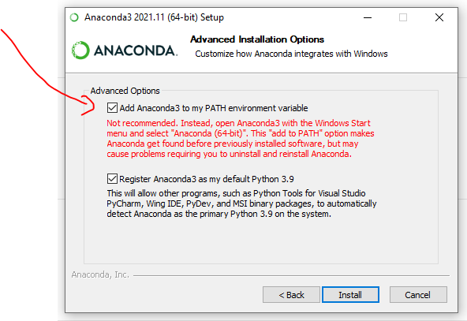
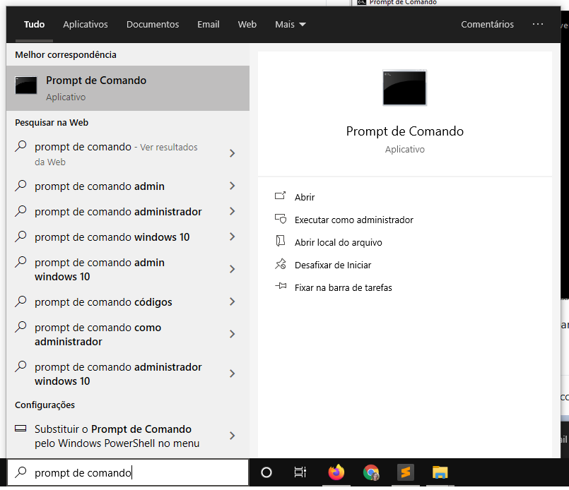
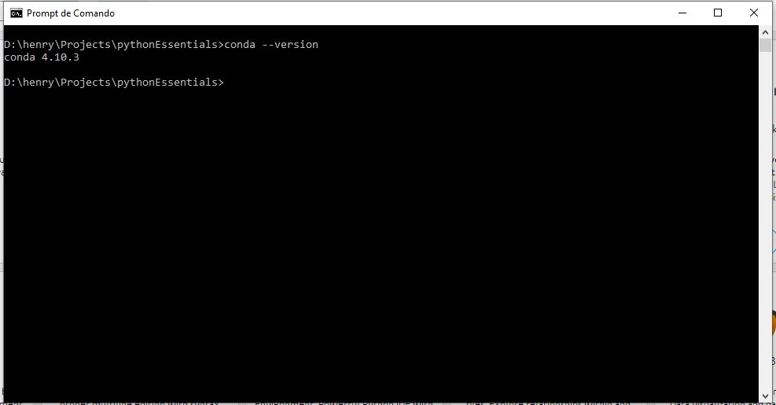
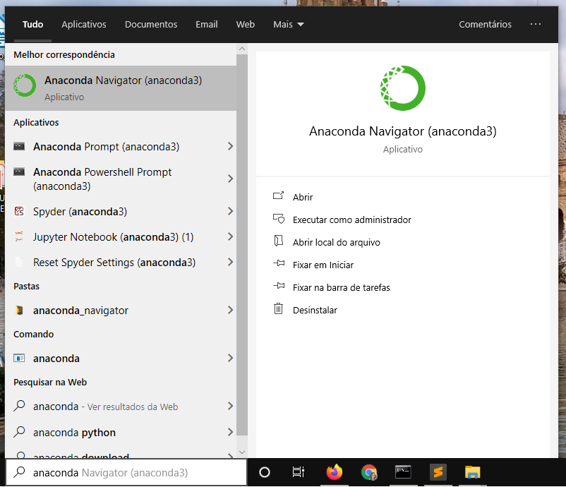
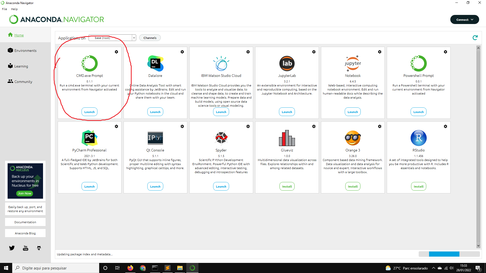

# Instalando e configurando o Python Anaconda

## Sumário

* [Passo-a-passo](#passo-a-passo)
* [Abrindo o Anaconda pela linha de comando do Windows](#abrindo-o-anaconda-pela-linha-de-comando-do-windows)
* [Abrindo o Anaconda pela linha de comando do Anaconda](#abrindo-o-anaconda-pela-linha-de-comando-do-anaconda)

## Passo-a-passo

1. Baixe o Python Anaconda da seguinte página: [link](https://www.anaconda.com/products/individual)
2. Siga as etapas do instalador 
3. Quando chegar nesta tela, marque a primeira opção:

**Se você não marcar esta opção agora, não conseguirá rodar nem o Python e nem o comando `conda`
a partir da linha de comando do Windows.** Veja a seção [Abrindo o Anaconda pela linha de comando do Anaconda](#abrindo-o-anaconda-pela-linha-de-comando-do-anaconda?) para saber como proceder.

## Abrindo o Anaconda pela linha de comando do Windows

1. Abra a linha de comando do seu computador:

2. digite `conda --version`
3. Se aparecer a seguinte tela, parabéns! Foi configurado corretamente

**Nota:** não há problema se a versão que aparecer não for exatamente a mesma da imagem.

## Abrindo o Anaconda pela linha de comando do Anaconda

1. Encontre o _launcher_ do Anaconda no computador:

2. Inicie o prompt de comando do Anaconda:

3. digite `conda --version`
4. Se aparecer a seguinte tela, parabéns! Foi configurado corretamente

**Nota:** não há problema se a versão que aparecer não for exatamente a mesma da imagem.