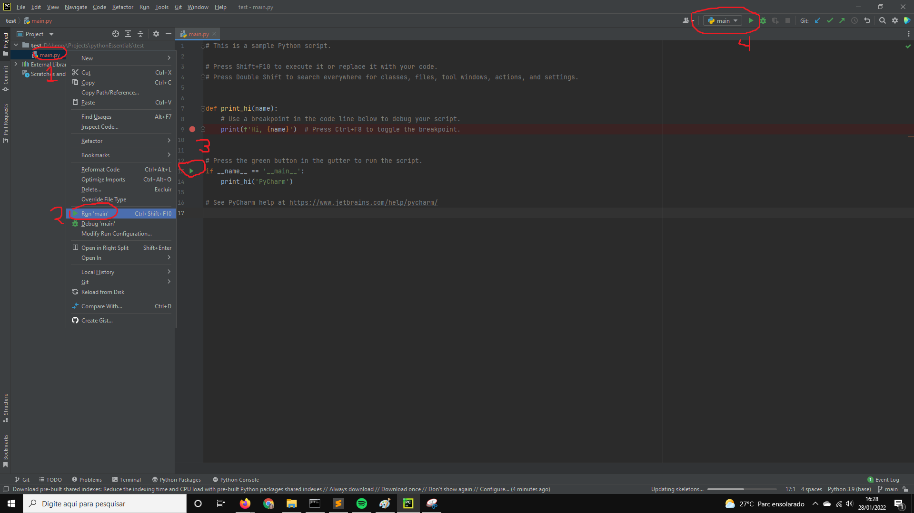
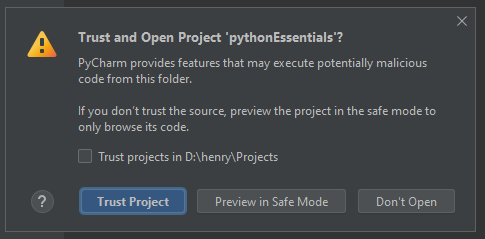

# Instalando e configurando o Pycharm

O Pycharm é um ambiente de desenvolvimento integrado (IDE, na 
sigla em inglês). Isto significa que ele concentra diversos
recursos que são comuns ao desenvolvimento de software, que 
agilizam o desenvolvimento do mesmo.

Você não precisa necessariamente usar o Pycharm como IDE durante
este curso, porém o suporte será dado para esta IDE. Porém, 
ao usar o Pycharm, você estará garantindo que seu código-fonte
siga automaticamente o [PEP 8](https://www.python.org/dev/peps/pep-0008/), 
uma padronização sobre como o código-fonte escrito em Python deve se comportar (por exemplo, usar espaços ao invés de 
tabulações, não exceder uma linha em mais de 79 caracteres,
deixar uma linha em branco entre definições de funções, etc).

Você pode ler um resumo dos requisitos do PEP 8 aqui: 
[link](https://docs.python.org/pt-br/3.9/tutorial/controlflow.html#intermezzo-coding-style)

## Sumário

1. [Instalando](#instalando)
2. [Primeira configuração](#primeira-configuração)
3. [Configurações subsequentes](#configurações-subsequentes)

## Instalando

1. Baixe a **Community Edition** do Pycharm, do seguinte [link](https://www.jetbrains.com/pt-br/pycharm/download/)
2. Siga as etapas do instalador
3. Abra o Pycharm Community Edition:

4. Aceite os termos e condições de uso

5. Se aparecer a seguinte tela, parabéns! O Pycharm foi instalado corretamente

## Primeira configuração

1. Abra o Pycharm Community Edition:

2. Na tela a seguir, clique em **New Project**

3. Na tela que abre a seguir, faça como demonstrado na figura, seguindo os passos a seguir:

	1. Escolha uma pasta para o projeto (neste exemplo, estou criando uma pasta `test` dentro do repositório atual)
	2. Marque a opção **Previously configured interpreter**
	3. Deixe selecionada a opção **create a main.py welcome script**
	4. Clique nos três pontinhos do lado de `<No interpreter>` 

4. Depois de clicar nos três pontinhos, faça como demonstrado na figura, seguindo os passos a seguir:

	1. Selecione a opção **Conda environment** na esquerda
	2. Selecione a opção **Make available to all projects** 
	3. Clique nos três pontinhos do lado de `<No interpreter>` 

5. No navegador de arquivos que abrir, encontre o programa python.exe

	* Por padrão, ele é instalado na pasta C:\\Users\\<seu nome de usuário>\\anaconda3\\python.exe
	* Se não estiver nesta pasta, você pode usar a busca do Windows para encontrar este programa

6. Aperte o botão Ok
7. Aperte o botão Ok
8. Caso tudo esteja certo, a tela de configuração do projeto deve estar assim agora:

9. Aperte o botão **Create**
10. Espere o Pycharm indexar o ambiente virtual (isso pode demorar um pouco):

11. Você pode executar o script de 3 formas diferentes:

	1. Clicando com o botão direito em cima do script no navegador de arquivos, e depois selecionando a opção **run <nome do script>** (nesse caso, main) (números 1 e 2 da figura)
	2. Clicando no triângulo verde no próprio script (número 3 da figura)
	3. Clicando no triângulo verde no lado superior direito (número 4 da figura)

## Configurações subsequentes 

Depois que você clonar um repositório que é uma atividade do curso, você pode abri-lo como um projeto do Pycharm

1. Abra o Pycharm Community Edition:

2. Na tela a seguir, clique em **Open**

3. Encontre a pasta do repositório que você clonou na sua máquina

4. Caso apareça esta tela, marque a opção **Trust Project**

5. Clique duas vezes com o botão esquerdo do mouse sobre o script que deseja executar, no navegador de arquivos da esquerda
6. Siga o passo 11 da seção anterior