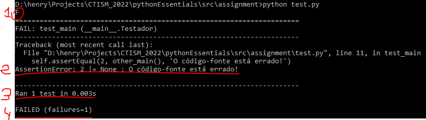
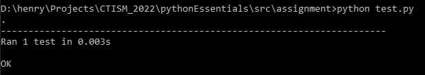

# Rodando testes

## Introdução

No decorrer deste curso, muitas atividades serão 
disponibilizadas com um arquivo `test.py` junto. Este
arquivo é um testador programado com a biblioteca 
[unittest](https://docs.python.org/3/library/unittest.html).

O objetivo do testador é validar se a atividade que você 
realizou foi feita corretamente ou não. Você **não deve** mexer
neste arquivo (a menos que seja para achar bugs no código!),
mas você **deve** executar este script.

As instruções a seguir servirão para qualquer arquivo `test.py`
disponibilizado durante este curso. Para facilitar as coisas,

## Passo-a-passo

Abra o arquivo [src/assignment/main.py](../src/assignment/main.py)
em algum editor de texto. O código-fonte dentro deste arquivo é o 
seguinte:

```python
def main():
    # apague o caractere # da linha abaixo
    # return 1 + 1
    pass  # apague esta linha

if __name__ == '__main__':
    main()
```

O que você deve fazer a seguir é rodar o script `test.py`, para
verificar se o exercício foi feito corretamente. Abra o prompt
de comando, navegue até a pasta assignment com o comando `cd`,
e rode `python test.py`. Como nós não mexemos nesse script, a 
saída do prompt será a seguinte:



Não parece animador, certo? Muitas coisas estão acontecendo ao
mesmo tempo. Vamos interpretá-las:

1. O `F` solitário é um resumo dos testes que foram rodados. Como
    apenas um teste foi rodado, existe apenas um `F` nesta linha.
    O `F` também significa **fail**, ou seja, que o teste que rodou
    falhou. Outras opções de caracteres nesta linha são `.` (o teste
    rodou, e passou), e `E` (o teste não rodou porque um **Erro** 
    ocorreu)
2. Esta linha está dizendo o porquê do teste ter falhado. Apesar do
    começo dessa linha ser criptográfica (com um `AssertionError`
    que não diz muita coisa agora), geralmente a mensagem de erro
    sou eu, o professor, quem escreve. Por exemplo, o "O código-fonte
    está errado!" fui eu que escrevi. Sempre procure por uma mensagem
    textual minha quando rodar um teste para descobrir o que está dando
    errado.
3. Esta linha diz quantos testes foram executaods, e em quanto tempo
4. Esta linha diz se você gabaritou o testador ou não. Como podemos ver,
    não gabaritamos (`FAILED` quer dizer isso), e nós temos uma resposta
    errada.

Vamos mexer no nosso código-fonte agora de maneira que ele gabarite o 
teste. Modifique o arquivo 
[src/assignment/main.py](../src/assignment/main.py) para ele ficar 
assim:

```python
def main():
    # apague o caractere # da linha abaixo
    return 1 + 1

if __name__ == '__main__':
    main()
```

Salve o arquivo, e rode novamente o testador pela linha de comando
(`python test.py`). A saída agora será diferente:




Sucesso! Gabaritamos o teste desta vez.