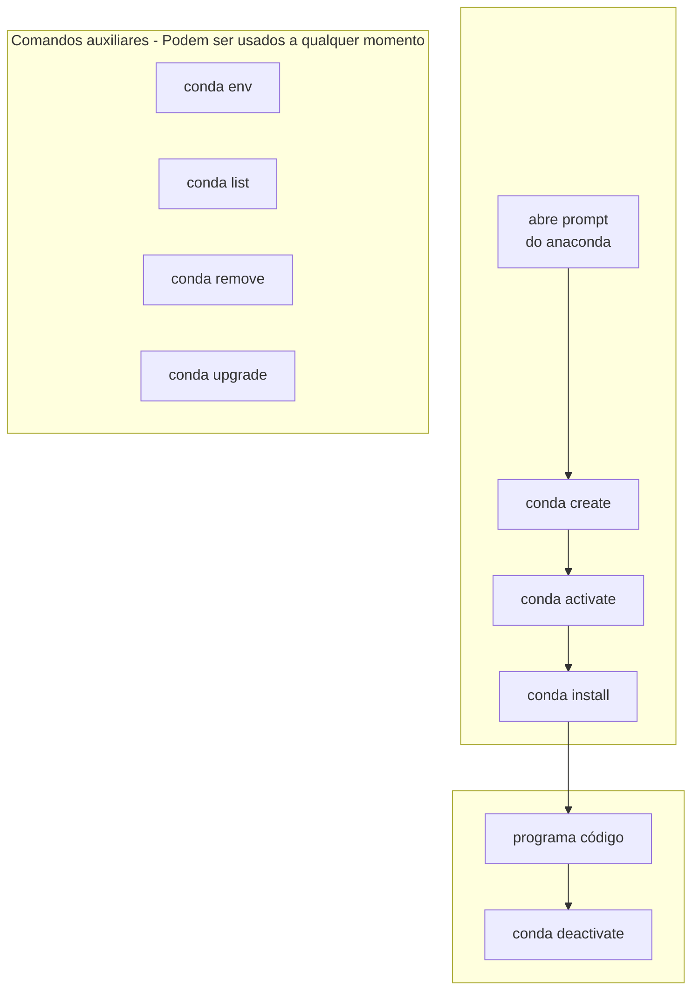
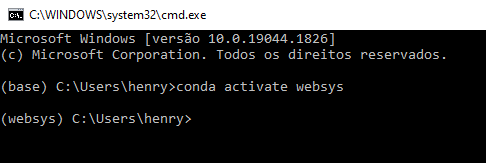

# Criando e manipulando ambientes virtuais do conda

## Sumário

* [Introdução](#introdução)
* [Guia rápido](#guia-rápido)
* [Criando pela linha de comando](#criando-pela-linha-de-comando)
* [Usando pela linha de comando](#usando-pela-linha-de-comando)
* [Usando pelo Pycharm](#usando-pelo-pycharm)

## Introdução

Ambientes virtuais são usados para manter isolado um ambiente de trabalho quando 
estamos trabalhando no Python, de forma que este ambiente não interfira com 
outros ambientes.

Por exemplo. Vamos supor que seu computador seja compartilhado, e que você 
esteja desenvolvendo um site com [Django](https://www.djangoproject.com/), 
enquanto a outra pessoa está desenvolvendo um algoritmo de Aprendizado de 
Máquina com [scikit-learn](https://www.djangoproject.com/). Pode ser que a 
biblioteca [NumPy](https://numpy.org/) seja utilizada por estas duas 
bibliotecas, mas o Django exige a versão 1.01, enquanto o scikit-learn exige a 
versão 1.09. Como é impossível conciliar esses dois requerimentos, é melhor 
criar um ambiente virtual para cada projeto de software.

## Guia rápido



## Criando pela linha de comando

1. [Abra a linha de comando do Anaconda no seu computador](
   anaconda.md#abrindo-o-anaconda-pela-linha-de-comando-do-anaconda)
2. Digite o comando

```bash
conda create --name websys --yes
```

Onde **websys** é o nome do ambiente virtual. Você pode colocar qualquer nome 
(teste, ctism, jorge, tanto faz), mas neste tutorial utilizaremos **websys**.

3. Ative o ambiente virtual com 

```bash
conda activate websys
```

Repare como nome do ambiente virtual sendo usado (que é escrito entre parênteses
antes do caminho da pasta atual, na linha de comando) mudou de **base** para 
**websys**:



3. Instale o instalador de pacotes auxiliar `pip`

```bash
conda install pip --yes
```

Pronto! Você acabou de criar, ativar e instalar um pacote/biblioteca através da 
linha de comando.

## Usando pela linha de comando

1. [Abra a linha de comando do Anaconda no seu computador](
   anaconda.md#abrindo-o-anaconda-pela-linha-de-comando-do-anaconda)
2. Ative o ambiente virtual com 

```bash
conda activate websys
```

3. Faça o que você tiver que fazer: você vai programar? Vai rodar um script
   pela linha de comando com com `python <nome do script>` (por exemplo, 
   `python main.py`)? Aqui é com você.
4. (Opcional) Após terminar seu trabalho, simplesmente feche a janela do prompt, 
   ou então desative o ambiente virtual com 

```bash
conda deactivate
```

## Usando pelo Pycharm

1. Abra um projeto no Pycharm (**File, Open, \<escolha a pasta do projeto\>**)
2. Começando pelo menu no canto superior direito, clique nas seguintes opções: 
   **File, Settings, Project: \<nome do projeto\>, Python Interpreter**
3. Na seguinte tela, selecione o ambiente virtual desejado (opção 1)


4. Ou, se você ainda não adicionou esse ambiente virtual ao Pycharm, clique na 
   engrenagem (opção 2)
5. Deixe as opções como na figura a seguir, clicando depois nos três pontinhos


6. Encontre onde está o python.exe do ambiente virtual. Por padrão, os ambientes
   virtuais são instalados em `C:\Users\<nome de usuário>\anaconda3\envs`
   * Outro lugar que eles podem estar é em 
     `C:\Users\<nome de usuário>\.conda\envs\<nome do ambiente virtual>\python.exe`
   * Por exemplo, `C:\Users\aluno\.conda\envs\websys\python.exe`


7. Feche todas as janelas que foram abertas, apertando Ok para tudo