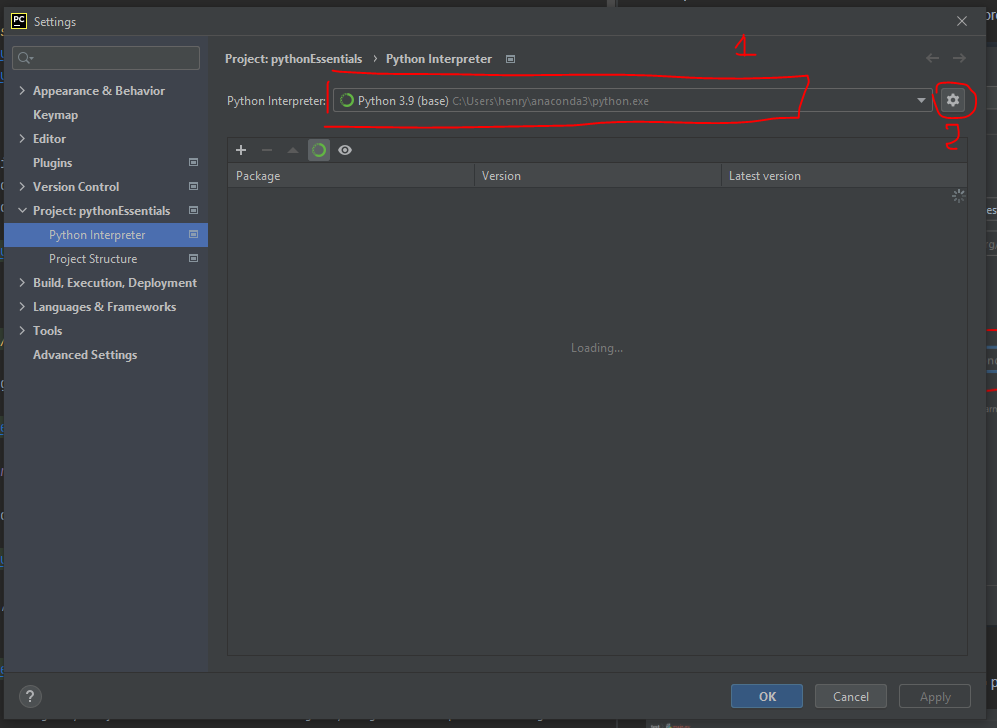
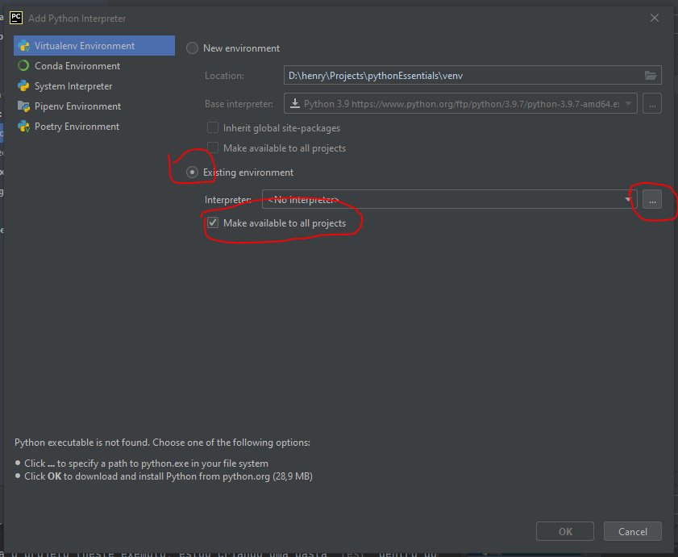
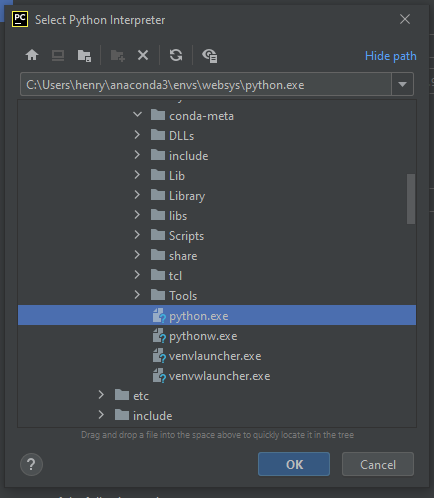

# Criando e manipulando ambientes virtuais do conda

## Sumário

* [Introdução](#introdução)
* [Criando e usando pela linha de comando](#criando-e-usando-pela-linha-de-comando)
* [Usando pelo Pycharm](#usando-pelo-pycharm)

## Introdução

Ambientes virtuais são usados para manter isolado um ambiente de trabalho quando estamos trabalhando no Python, de forma que este ambiente não interfira com outros ambientes.

Por exemplo. Vamos supor que seu computador seja compartilhado, e que você esteja desenvolvendo um site com [Django](https://www.djangoproject.com/), enquanto a outra pessoa
está desenvolvendo um algoritmo de Aprendizado de Máquina com [scikit-learn](https://www.djangoproject.com/). Pode ser que a biblioteca [NumPy](https://numpy.org/) seja utilizada
por estas duas  bibliotecas, mas o Django exige a versão 1.01, enquanto o scikit-learn exige a versão 1.09. Como é impossível conciliar esses dois requerimentos, é melhor criar 
um ambiente virtual para cada projeto de software.

## Criando e usando pela linha de comando

1. Abra a linha de comando no seu computador 
2. Digite o comando

```bash
conda create --name websys --yes
```

3. Ative o ambiente virtual com 

```bash
conda activate websys
```

3. Instale o instalador de pacotes auxiliar `pip`

```bash
conda install pip --yes
```

Pronto! Você acabou de criar, ativar e instalar um pacote/biblioteca através da linha de comando.

4. Para desativar o ambiente virtual (e voltar a usar o Python padrão), digite 

```bash
conda deactivate
```

## Usando pelo Pycharm

1. Abra um projeto no Pycharm
2. Começando pelo menu no canto superior direito, clique nas seguintes opções: **File, Settings, Project: \<nome do projeto\>, Python Interpreter**
3. Na seguinte tela, selecione o ambiente virtual desejado (opção 1)



4. Ou, se você ainda não adicionou esse ambiente virtual ao Pycharm, clique na engrenagem (opção 2)
5. Deixe as opções como na figura a seguir, clicando depois nos três pontinhos



6. Encontre onde está o python.exe do ambiente virtual. Por padrão, os ambientes virtuais são instalados em `C:\Users\<nome de usuário>\anaconda3\envs`
   * Outro lugar que eles podem estar é em `C:\Users\<nome de usuário>\.conda\envs\<nome do ambiente virtual>\python.exe`
   * Por exemplo, `C:\Users\aluno\.conda\envs\websys\python.exe`



7. Aperte o botão Ok
8. Aperte o botão Ok
9. Aperte o botão Ok